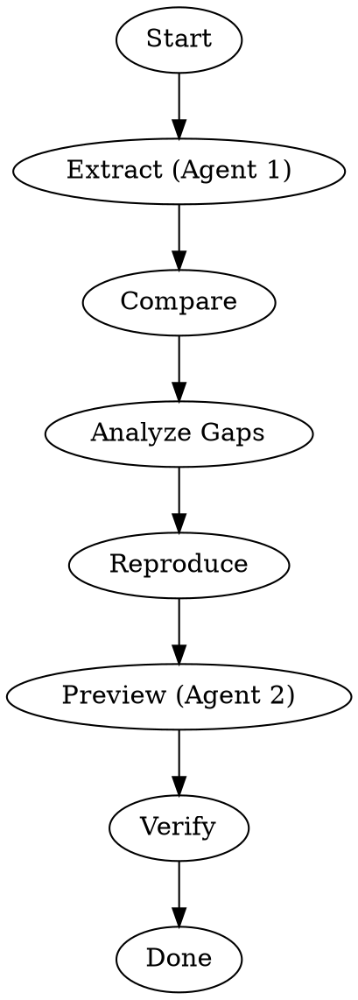

# Component Reproduction and Comparison

## Overview

Systematically reproduce and compare components against shadcn/ui reference using a structured workflow with agent team coordination. This skill ensures consistent quality across功能、性能 and易用性.

## When to Use

- 需要复现 shadcn/ui 组件到本地项目
- 需要对比本地组件与 shadcn/ui 实现的差异
- 需要系统化整改组件以达到 shadcn/ui 水平
- 需要为多个组件同时进行对比和复现
- 需要协调多个子任务（提取、对比、实现、预览）

**When NOT to use:**
- 简单查看组件代码（直接 read 文件即可）
- 单个组件快速修复（不需要完整流程）
- 只需要提取 shadcn 信息（使用 shadcn-ui-component-extractor）

## Core Workflow



## Required Skills

**MUST use these skills:**
- **REQUIRED:** Use shadcn-ui-component-extractor for extracting component info
- **REQUIRED:** Use component-library-comparison for gap analysis
- **REQUIRED:** Use angular-component-preview for preview pages

## Step-by-Step Process

### Step 1: Extract (Parallel for Multiple Components)

使用 shadcn-ui-component-extractor 技能提取组件信息：

```bash
# 提取单个组件
Skill: shadcn-ui-component-extractor
# 输入: button, input, textarea 等组件名

# 提取多个组件时，使用并行 agent
Task: extract-button (使用 shadcn-ui-component-extractor)
Task: extract-input (使用 shadcn-ui-component-extractor)
```

**提取内容：**
- HTML 结构
- CSS 类名和样式
- TypeScript 类型定义
- ARIA 属性
- 交互行为

### Step 2: Read Local Implementation

```bash
# 确定组件位置
src/app/shared/ui/<component-name>/
```

**检查内容：**
- 实现方式（Directive / Component）
- 使用的技术栈（Signals, CVA, OnPush）
- 缺失的功能
- 代码质量

### Step 3: Compare and Analyze Gaps

使用 component-library-comparison 技能进行对比：

```bash
Skill: component-library-comparison
# 输入: shadcn 提取结果 + 本地实现
# 输出: 对比表格 + 差距分析
```

**对比维度：**
| 维度 | 检查点 |
|------|--------|
| 功能完整性 | variant, size, state, props |
| 样式对齐 | CSS 类名, 颜色, 间距 |
| 可访问性 | ARIA, keyboard, focus |
| 性能 | ChangeDetection, signals |
| TypeScript | 类型安全, strict mode |

### Step 4: Reproduce / Fix

根据差距分析进行整改：

**优先级：**
1. 功能缺失（必须修复）
2. 样式不对齐（高优先级）
3. 可访问性问题（高优先级）
4. 性能问题（中优先级）
5. 代码质量（低优先级）

**整改模式：**
- 如果本地实现优于 shadcn → 保持，记录差异
- 如果 shadcn 有本地没有的功能 → 添加
- 如果两者都缺失 → 按需求添加

### Step 5: Preview (MUST EXECUTE)

**必须执行预览步骤**，不能跳过：

```bash
# 首先加载预览技能
Skill: angular-component-preview

# 然后添加组件到预览系统
# 按照技能指引，创建预览组件并添加到路由
```

**预览内容必须包含：**
- 所有 variants (default, secondary, destructive, outline, ghost, link)
- 所有 sizes (xs, sm, default, lg, icon)
- 所有 states (disabled, loading, error)
- 交互演示（点击、聚焦、hover）

**验证标准：**
- 预览页面必须能正常运行
- 启动 dev server 后访问 `/preview/{component}` 能看到组件

### Step 6: Verify

验证整改结果：
- 功能正常
- 样式对齐
- 无 console 错误
- 可访问性通过

## Agent Team Coordination (Optional but Recommended)

**使用场景：**
- 多个组件同时需要对比（>= 2 个组件）
- 需要并行提取信息加速流程

**对于单个组件：** 直接顺序执行即可

**对于多个组件：** 使用 agent team 并行处理：

### Team Structure

```
Team: component-reproduction
├── Agent 1: Extractor (并行)
│   └── 提取 shadcn 信息
├── Agent 2: Comparator
│   └── 对比分析
├── Agent 3: Implementer
│   └── 整改实现
└── Agent 4: Previewer
    └── 预览展示
```

### Dispatch Pattern

```typescript
// 并行提取多个组件
Task: extract-{component1} (subagent_type: Explore)
Task: extract-{component2} (subagent_type: Explore)

// 等待所有提取完成后，进行对比
Task: compare-all (subagent_type: Plan)

// 对比完成后，串行整改
Task: fix-{component1} (subagent_type: general-purpose)
Task: fix-{component2} (subagent_type: general-purpose)

// 最后创建预览
Task: preview-all (subagent_type: general-purpose)
```

### Communication

- 使用 SendMessage 工具在 agent 之间传递信息
- 提取结果存储在共享位置供后续步骤使用
- 对比结果作为整改的输入

## Quick Reference

| 阶段 | 技能/工具 | 输出 |
|------|----------|------|
| 提取 | shadcn-ui-component-extractor | 组件信息 |
| 读取 | read 本地代码 | 实现细节 |
| 对比 | component-library-comparison | 差距报告 |
| 整改 | 编辑器 | 修复后代码 |
| 预览 | angular-component-preview | 可运行页面 |

## Common Mistakes

### ❌ Skipping Skills
直接手动提取信息，而不是使用 shadcn-ui-component-extractor

**Fix:** Always invoke skill first: `Skill: shadcn-ui-component-extractor`

### ❌ No Gap Analysis
直接开始整改，没有先分析差距

**Fix:** Use component-library-comparison to get structured gap report

### ❌ Single Agent for Everything
不用 agent team，单独一个 agent 完成所有任务

**Fix:** Dispatch parallel agents for extraction, sequential for fixing

### ❌ Forgetting Preview
整改完成后不创建预览页面

**Fix:** Always end with angular-component-preview

### ❌ Manual Comparison
手动对比而不是使用 component-library-comparison

**Fix:** Invoke skill: `Skill: component-library-comparison`

## Output Artifacts

完成流程后生成：

1. **对比报告** (可选)
   - 位置: `docs/component-comparison/{component}.md`

2. **预览页面**
   - 路由: `/preview/{component}`

3. **改进后的组件代码**
   - 位置: `src/app/shared/ui/{component}/`
